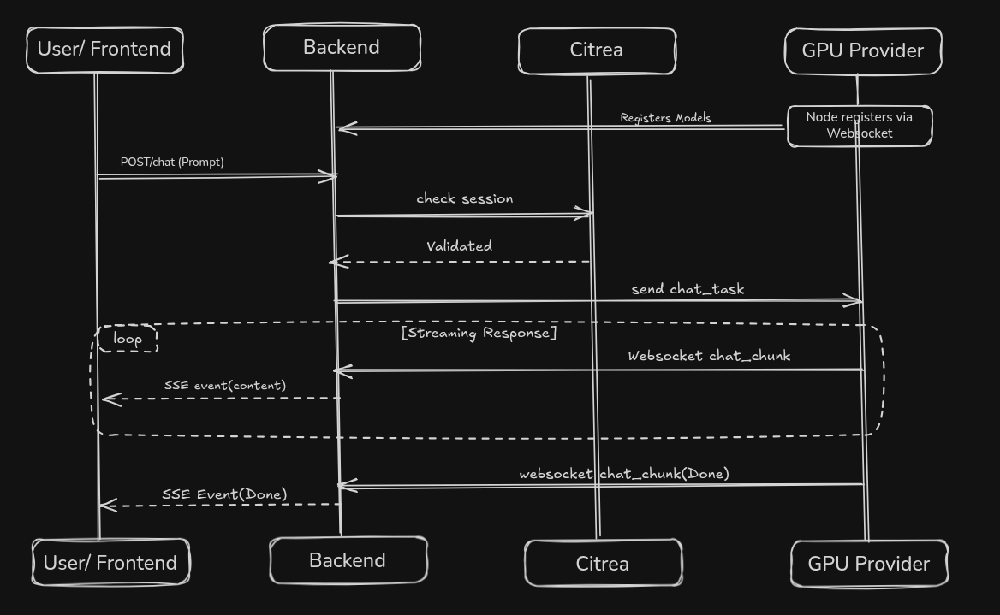

# The Bit-Brain Deployment Instructions

This repository contains the smart contracts, Python FastAPI backend, React/Vite frontend, and Decentralized Node scripts for **The Bit-Brain Network**. 

## System Architecture

BitBrain is a decentralized AI inference gateway that bridges blockchain-based access control with a distributed network of GPU providers.



**Key Features:**
- **Decentralized Inference**: Tasks are relayed to independent GPU providers.
- **On-Chain Access**: Session validation occurs directly on the Citrea testnet.
- **Real-time Streaming**: End-to-end streaming delivery from GPU to User via WebSockets and SSE.


## 1. Smart Contract
Deploy `contracts/BitBrainVault.sol` to the Citrea Testnet (Chain ID 5115) using Hardhat or Foundry. 
Keep track of the `CONTRACT_ADDRESS`.

## 2. Backend Hub (FastAPI)

The FastAPI backend serves as the central switchboard. It no longer requires a local LLM! Instead, it relays AI generation requests to decentralized providers over secure WebSockets.

Deploy the backend manually or automatically using natively compatible platforms like Render (see `render.yaml`).
```bash
cd backend
python -m venv venv
source venv/bin/activate
pip install -r requirements.txt

# Start the Hub
uvicorn main:app --host 0.0.0.0 --port 8000
```

## 3. Decentralized Node Providers

Anyone can join the network to provide AI inference and earn cBTC! As a GPU provider, you connect directly to the central backend. You do **not** need to port forward or expose your local network.

### Prerequisites
- [Ollama](https://ollama.com/) installed and running.
- Python 3.10+
- A wallet address to receive rewards.

### Setup & Execution
The simplest way to join is to use the automated setup script:

```bash
cd node
chmod +x setup_and_run.sh
./setup_and_run.sh
```

**What the script does:**
1. **Ollama Check**: Installs Ollama if missing and ensures the daemon is running.
2. **Configuration**: Prompts for your **Wallet Address** and preferred **Model** (e.g., `llama3`).
3. **Model Sync**: Automatically pulls the selected model via Ollama.
4. **Environment Setup**: Creates a Python virtual environment and installs dependencies (`websockets`, `aiohttp`).
5. **Bridge Connection**: Launches `run_node.py` which establishes an outbound WebSocket connection to the BitBrain gateway.

### Dynamic Updates
Once running, the node monitors your local Ollama library. If you pull new models manually (`ollama pull <model>`), the node will automatically register them with the gateway, making them available to users in the frontend.

## 4. Frontend Configuration (React / Vite)

The frontend uses Privy + Viem. It requires strict configuration for the custom Citrea Chain to work in injected wallets and Privy embedded wallets.

The frontend is fully compatible with Vercel and can be deployed directly via `vercel.json`. Set the `VITE_API_URL` environment variable to your deployed backend URL.

To run the frontend dashboard locally:
```bash
cd frontend
npm install
npm run dev
```

Enjoy your decentralized AI cypherpunk gateway!
